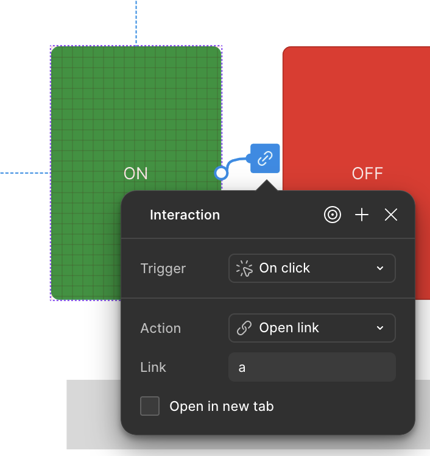
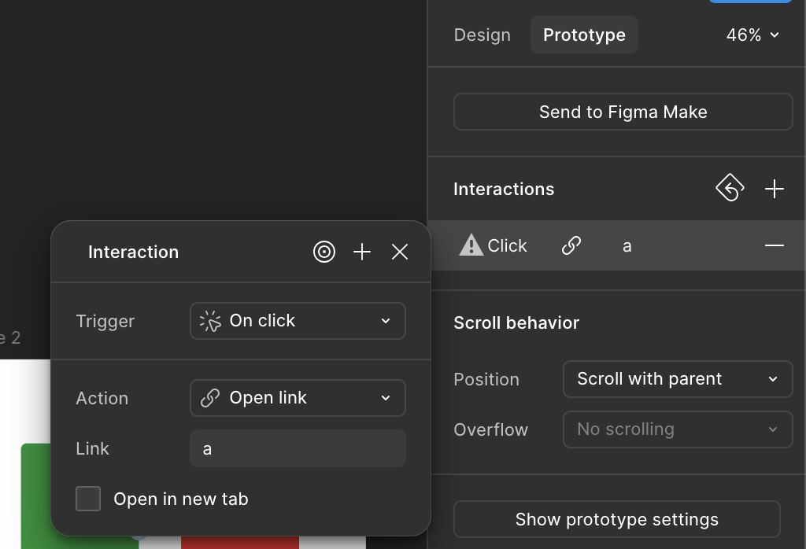

# What Is FigProxyWEB?

- FigProxyWEB is a tool that enables rapid prototyping of tangible user experiences, allowing Figma prototypes to talk to the external world.
- More specifically, it's a **browser extension** that allows bidirectional communication between Figma and physical hardware for prototyping interactions that involve screens and physical elements like motors, lights, sensors etc.
- It's designed to talk to hardware prototyping platforms like Arduino (or anything speaking serial: ESP32, RP2040, 3D printers…).
- It's a subsidiary work inspired by [Figproxy](https://github.com/ideo/Figproxy) by [Dave Vondle](https://edges.ideo.com/author/dave-vondle) (IDEO) — same idea, no native app required. It's also a nod to [serproxy](https://github.com/cetola/serproxy) by Stefano Busti & [David Mellis](https://github.com/damellis).

## Why a Browser Extension?

Figproxy is a **macOS app only** ("it would have to be developed from the ground up for Linux or Windows"). FigProxyWEB answers that call: it ports the idea to **any OS** by living entirely in the browser, using the [Web Serial API](https://developer.mozilla.org/en-US/docs/Web/API/Web_Serial_API). No installer, no admin rights, no accessibility permissions — if your machine runs Chrome or Firefox, you can plug a board in and drive it from a Figma prototype.

## What Does It Run On? (Any OS)

- **Google Chrome** 121+ (also Edge, Opera and other Chromium browsers) on Windows, macOS, Linux, ChromeOS.
- **Mozilla Firefox** 151+ on desktop (Web Serial shipped in Firefox 151, May 2026).
- Anything with a USB port and one of the above: PCs, laptops… (mobile browsers don't expose Web Serial, so desktop it is).

## Use Cases

- **Kiosks** - Soda Machines, Jukeboxes, Movie Ticket Printers, ATMs
- **Vehicle UI** - Control lights, radio, seats etc.
- **Museum Exhibits** - Make a button or action that changes what is on the screen
- **Home Automation** - Prototype a UI to trigger lights, locks, shades etc. And make it actually work
- **Hardware "Sketching"** - Quickly test out functionality with a physical controller and digital twin before building a more complicated physical prototype
- **Games** - Make a physical spinner or gameplay element that talks to a Figma game
- **A ton more** - I'm excited to see what you do with it!

## Installation

### From source (developer mode)

1. Clone this repo and build both targets (no dependencies, plain Node):
   ```bash
   npm run build
   ```
   This produces `dist/chrome/` and `dist/firefox/` plus store-ready `.zip` files.
2. **Chrome:** open `chrome://extensions`, enable *Developer mode*, *Load unpacked* → `dist/chrome/`.
3. **Firefox:** open `about:debugging` → *This Firefox* → *Load Temporary Add-on* → `dist/firefox/manifest.json`. (Temporary add-ons unload when Firefox quits — reload them on restart.)

### Stores

- Chrome Web Store and Firefox AMO listings are on the way. Until then, use the developer-mode builds above.

## How It Works

Figma does not support communication to other software in its API. Because we can't go the official route, FigProxyWEB uses the same class of "hack" as Figproxy: it watches what the prototype *does* and translates it to serial.

### Speaking Out (Figma → Arduino)

*Note: "Arduino" is shorthand for any hardware that speaks over a serial connection.*

#### The trick: `Open link` with any URL

In Figma you make **any clickable layer open a link** — for example `http://a`, `http://b`, `http://hello` or `http://slider/42`. When the prototype runs, Figma tries to navigate to `figma.com/exit?url=…`. The extension intercepts that navigation, blocks it, and writes the **last segment of the URL** (`a`, `b`, `hello`, `42` …) to the serial port, newline-terminated. Nothing actually opens in the browser — the string just goes out over USB.

> **You can use any text you want.** `a` and `b` are just minimal examples. Use descriptive names like `http://ledOn`, `http://motor/100`, `http://next` — whatever your Arduino code expects.

#### Step-by-step in Figma (with screenshots)

1. Select a layer (e.g. a button labeled **ON**).
2. In the right panel go to **Prototype** → under **Interactions** click **+**.
3. Set **Trigger** to **On click** (or `On tap`, `On drag`, etc.).
4. Set **Action** to **Open link**.
5. In **Link**, type your URL — e.g. `a`, `http://a` or `http://motor/on`. Figma accepts even a bare `a` and turns it into a link.
6. Leave **Open in new tab** **unchecked**.
7. Do the same for another button (e.g. **OFF** → `http://b`).
8. Click **Present** (▶) to run the prototype, connect the extension to your board, and press the buttons.



*Above: the green **ON** button sends `a`, the red **OFF** sends `b`. The blue link icon and popup show the prototyping connection.*



*Detail: set **Trigger** = `On click`, **Action** = `Open link`, **Link** = `a` (or `b`, `hello`, anything). That's all the extension needs.*

> Tip: you need to be in **Present mode** (the prototype viewer) for the link navigation to fire. Clicking in the editor canvas alone won't send anything.

In Arduino, listen for it like this (full working example in [`example/`](example/)):

```cpp
if (Serial.available() > 0) {
  // get incoming byte:
  char incomingByte = Serial.read();
  // in Figma the "Turn LED On" button sends "a", "Turn LED Off" sends "b"
  if (incomingByte == 'a') {
    // ON button pressed
  } else if (incomingByte == 'b') {
    // OFF button pressed
  }
}
```

Need more than one character? Use links like `http://slider/5` — the extension sends `5`. Values are newline-terminated lines, so `Serial.readStringUntil('\n')` works too. For longer commands use e.g. `http://led/red` → `red`, or `http://F2S:SLIDER:brightness:128` for the reserved continuous-control protocol.

### Speaking In (Arduino → Figma)

In Arduino, send a character:

```cpp
Serial.println('c');
```

The extension re-dispatches each incoming line into the Figma page as a keypress. To react to it, give a frame an interaction with a **keyboard trigger** for that key (e.g. pressing `c` navigates to another frame). See [`example/README.md`](example/README.md) for the full setup.

> Note: page-injected keypresses are synthetic ("untrusted") by browser design — they work with Figma's key triggers and most web UIs, but can't do OS-level things.

## Software Options & Debugging

Click the extension icon while a Figma prototype tab is active:

- **Port**: dropdown of the serial ports already granted to Figma, plus *Refresh* and *New port…* to authorize a new one through the browser picker. (Browsers only reveal granted ports — the very first grant must start from a real click inside the Figma page: the ○ F2S badge or any click with auto-connect on.)
- **Baud rate**: must match `Serial.begin(...)` in your sketch (default 9600).
- **Auto-connect on first click**: connects (and opens the port picker on first use) as soon as you click inside Figma. On by default.
- **Last events**: live TX/RX log so you can see what crossed the wire without touching code.
- A small **○/● F2S badge** floats in the corner of every Figma prototype page: click it to connect/disconnect without opening the popup.

If the port list stays empty, check: data-capable USB cable (not charge-only), USB-serial drivers (CH340/CP210x), and that Arduino IDE's Serial Monitor is closed (ports are exclusive).

## Examples

- [`example/figproxyweb-basic/`](example/figproxyweb-basic/) — NeoPixel on a Waveshare RP2040 Zero: Figma button `a` → green, `b` → red.
- [`example/README.md`](example/README.md) — how to wire the Figma buttons and the keystroke action for the reverse direction.

## Developers

```
npm run build          # both browsers
npm run build:chrome   # dist/chrome/
npm run build:firefox  # dist/firefox/
```

Single codebase: `manifest.json` is the source of truth (Manifest V3), `build.mjs` derives the Firefox variant (background scripts + gecko id — replace it with your own before AMO submission). `lib/browser-api.js` is a tiny `browser`/`chrome` shim, `rules/figma-exit.json` holds the declarativeNetRequest rule, and the `F2S:` message protocol (`F2S:SLIDER:<id>:<value>`) is reserved for continuous controls.

## Credits & License

Idea and "Speaking Out / Speaking In" concept: [Figproxy](https://github.com/ideo/Figproxy) by Dave Vondle, IDEO — MIT licensed. This project is an independent, browser-based re-implementation of that idea.

MIT license — see [LICENSE](LICENSE).
